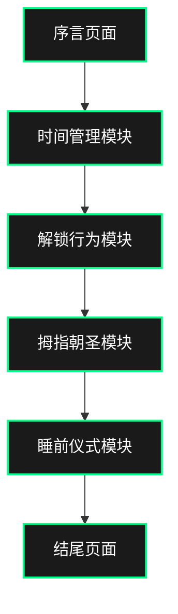

## 1. 产品概述
《如何使用人类：智能手机插画手册》是一个讽刺互动网站，以智能手机的视角展示如何"训练"人类用户。通过幽默的教程式交互，揭示现代人对手机的依赖行为。

目标用户：喜欢黑色幽默、对科技依赖现象感兴趣的互联网用户，以及寻找独特互动体验的访客。

## 2. 核心功能

### 2.1 用户角色
本网站为访客提供统一的互动体验，无需用户注册或区分角色。

### 2.2 功能模块
网站包含以下核心页面：
1. **序言页面**：欢迎信息和警告提示
2. **时间管理模块**：屏幕时间与睡眠时间的平衡滑块
3. **解锁行为模块**：模拟手机解锁和通知交互
4. **拇指朝圣模块**：滚动距离追踪和山峰隐喻
5. **睡前仪式模块**：睡姿选择和夜间模式
6. **结尾页面**："什么都不做"的终极交互

### 2.3 页面详情
| 页面名称 | 模块名称 | 功能描述 |
|---------|---------|---------|
| 序言页面 | 欢迎区域 | 显示恭喜获得新人类的标题和警告信息 |
| 序言页面 | 导航入口 | 提供进入模块1的按钮 |
| 时间管理模块 | 时间轴显示 | 展示当前屏幕时间和睡眠时间的数值 |
| 时间管理模块 | 平衡滑块 | 允许用户拖动调整时间分配，自动回到默认值 |
| 时间管理模块 | 视觉反馈 | 屏幕时间显示黄色/荧光色，睡眠时间显示暗灰色 |
| 时间管理模块 | 自动动画 | 屏幕时间缓慢增加，睡眠时间缓慢减少 |
| 解锁行为模块 | 锁屏界面 | 显示时间、日期和解锁提示 |
| 解锁行为模块 | 解锁交互 | 支持滑动解锁和点击解锁 |
| 解锁行为模块 | 通知系统 | 随机显示通知图标和声音 |
| 解锁行为模块 | 图标动画 | 应用图标闪烁和微振动效果 |
| 拇指朝圣模块 | 滚动追踪 | 实时计算滚动距离 |
| 拇指朝圣模块 | 山峰可视化 | 将滚动距离转换为山峰高度 |
| 拇指朝圣模块 | 疲劳效果 | 拇指图标颜色变化和弯曲动画 |
| 拇指朝圣模块 | 进度奖励 | 达到里程碑时显示庆祝动画 |
| 睡前仪式模块 | 姿势选择 | 提供侧卧、仰卧、俯卧三种选项 |
| 睡前仪式模块 | 背景适配 | 根据姿势调整屏幕角度和亮度 |
| 睡前仪式模块 | 消息推送 | 显示食物或娱乐相关的通知 |
| 睡前仪式模块 | 呼吸动画 | 模拟手机陪伴的呼吸效果 |
| 结尾页面 | 等待交互 | 提示用户5秒内不要操作 |
| 结尾页面 | 渐变动画 | 屏幕缓慢变暗显示结尾文案 |

## 3. 核心流程
用户访问网站后，按顺序体验各个模块：
1. 阅读序言，了解网站概念
2. 进入时间管理，体验时间分配的概念
3. 解锁行为模块，感受无意识解锁
4. 拇指朝圣，体验滚动成瘾
5. 睡前仪式，感受夜间陪伴
6. 结尾页面，完成整个体验

## 4. 用户界面设计

### 4.1 设计风格
- **主色调**：深黑色背景 (#0a0a0a)
- **强调色**：荧光绿 (#00ff88)、亮黄色 (#ffff00)
- **辅助色**：深灰色 (#1a1a1a)、暗灰色 (#333333)
- **按钮样式**：圆角矩形，悬停时有发光效果
- **字体**：无衬线字体，主要使用16-24px，标题使用32-48px
- **布局风格**：全屏单页式，每个模块独立成页
- **图标风格**：简约线条图标，配合荧光效果

### 4.2 页面设计概述
| 页面名称 | 模块名称 | UI元素 |
|---------|---------|---------|
| 序言页面 | 欢迎区域 | 大标题使用48px荧光绿字体，警告文本使用黄色高亮，背景为深黑色渐变 |
| 时间管理模块 | 时间轴显示 | 数字使用发光效果，天平图标使用CSS动画实现微微倾斜 |
| 时间管理模块 | 平衡滑块 | 滑块轨道使用暗灰色，滑块按钮使用荧光绿，有呼吸灯效果 |
| 解锁行为模块 | 锁屏界面 | 模拟真实手机锁屏，时间字体大而清晰，解锁条有滑动提示 |
| 解锁行为模块 | 通知系统 | 通知从顶部滑入，伴随微振动效果和提示音 |
| 拇指朝圣模块 | 山峰可视化 | 使用CSS绘制山峰轮廓，高度随滚动变化，有渐变色彩 |
| 拇指朝圣模块 | 疲劳效果 | 拇指图标使用SVG，通过CSS滤镜实现颜色变化 |
| 睡前仪式模块 | 姿势选择 | 三个姿势使用图标表示，选中时有放大和发光效果 |
| 睡前仪式模块 | 背景适配 | 根据姿势调整屏幕角度，使用3D变换实现倾斜效果 |
| 结尾页面 | 等待交互 | 倒计时数字逐渐变淡，背景缓慢变暗 |

### 4.3 响应式设计
- **设计原则**：桌面优先，移动适配
- **断点设置**：768px（平板）、480px（手机）
- **触摸优化**：移动设备上增大点击区域，滑块操作更灵敏
- **性能考虑**：使用CSS动画而非JavaScript动画，确保流畅性

### 4.4 动画指导
- **动画风格**：流畅的物理动画，模拟真实物体运动
- **缓动函数**：主要使用ease-out和cubic-bezier(0.4, 0, 0.2, 1)
- **动画时长**：微交互150-300ms，页面过渡500-800ms
- **特殊效果**：发光效果使用box-shadow和text-shadow实现，呼吸效果使用keyframes动画