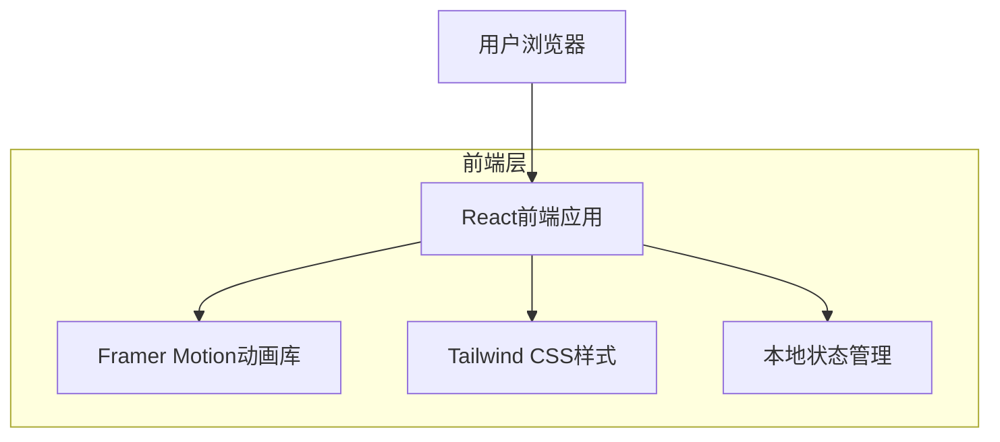
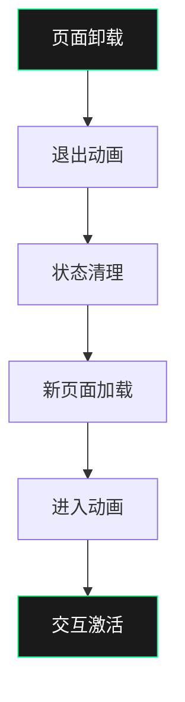

## 1. 架构设计



## 2. 技术描述
- **前端框架**：React@18 + TypeScript
- **初始化工具**：vite-init
- **样式框架**：Tailwind CSS@3
- **动画库**：Framer Motion
- **图标库**：Lucide React
- **构建工具**：Vite
- **包管理器**：npm
- **部署方式**：静态网站托管（Vercel/Netlify）

## 3. 路由定义
| 路由 | 用途 |
|-------|---------|
| / | 序言页面，显示欢迎信息和导航 |
| /time-management | 时间管理模块，展示屏幕时间与睡眠时间平衡 |
| /unlock-behavior | 解锁行为模块，模拟手机解锁交互 |
| /thumb-pilgrimage | 拇指朝圣模块，滚动距离追踪和山峰可视化 |
| /bedtime-rituals | 睡前仪式模块，睡姿选择和夜间模式 |
| /ending | 结尾页面，"什么都不做"的终极交互 |

## 4. 组件架构

### 4.1 核心组件结构
```typescript
// 主应用组件
interface AppProps {
  // 全局配置
}

// 模块页面组件
interface ModuleProps {
  onNext: () => void;
  onPrevious: () => void;
}

// 交互组件
interface SliderProps {
  min: number;
  max: number;
  value: number;
  onChange: (value: number) => void;
  label: string;
}

interface NotificationProps {
  message: string;
  type: 'info' | 'warning' | 'success';
  onClose: () => void;
}
```

### 4.2 状态管理定义
```typescript
// 全局状态接口
interface AppState {
  currentModule: number;
  timeManagement: {
    screenTime: number;
    sleepTime: number;
  };
  unlockStats: {
    unlockCount: number;
    lastUnlockTime: number;
  };
  scrollStats: {
    totalDistance: number;
    dailyDistance: number[];
  };
  bedtimePrefs: {
    position: 'side' | 'supine' | 'prone';
    brightness: number;
  };
}

// 动画状态
interface AnimationState {
  isAnimating: boolean;
  currentPhase: 'idle' | 'entering' | 'exiting';
  direction: 'next' | 'previous';
}
```

## 5. 动画系统设计

### 5.1 页面过渡动画


### 5.2 微交互定义
- **滑块拖拽**：使用Framer Motion的drag约束
- **按钮点击**：scale和opacity组合动画
- **通知出现**：slideIn + fadeIn组合
- **数值变化**：spring物理动画
- **背景渐变**：颜色插值动画

## 6. 性能优化策略

### 6.1 代码分割
- 按路由懒加载组件
- 动态导入大型动画库
- 预加载下一个模块资源

### 6.2 渲染优化
- 使用React.memo缓存纯组件
- 虚拟化长列表（如滚动历史）
- CSS动画优先于JavaScript动画
- will-change属性优化重绘

### 6.3 资源优化
- 图片使用WebP格式
- SVG图标内联减少请求
- 字体子集化减少体积
- 启用Gzip压缩

## 7. 浏览器兼容性
- **支持浏览器**：Chrome 90+, Firefox 88+, Safari 14+, Edge 90+
- **polyfill策略**：核心功能降级处理
- **CSS特性**：使用@supports查询渐进增强
- **JavaScript特性**：TypeScript编译目标ES2020

## 8. 可访问性设计
- **键盘导航**：支持Tab键切换焦点
- **屏幕阅读器**：ARIA标签和描述
- **色彩对比**：满足WCAG 2.1 AA标准
- **动画偏好**：尊重prefers-reduced-motion设置
- **触摸目标**：最小44px点击区域